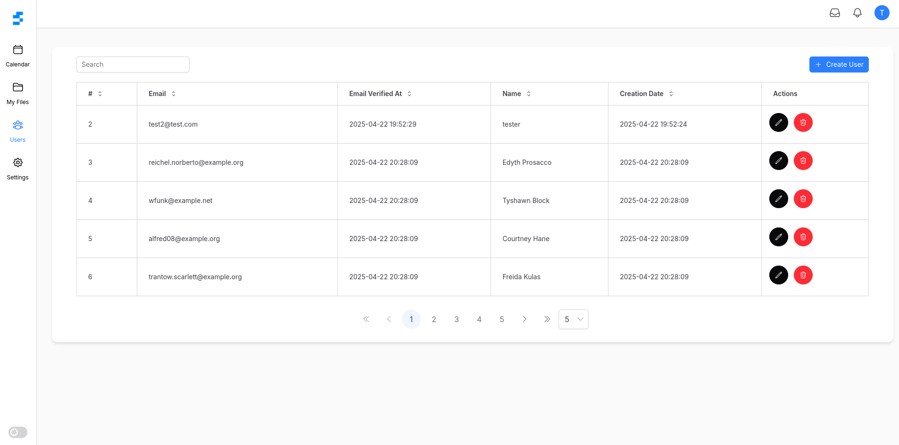

# Sassfolding



## Table of Contents

- [Introduction](#introduction)
- [Features](#features)
- [Requirements](#requirements)
- [Installation](#installation)
- [Usage](#usage)
- [Known Issues](#known-issues)
- [Contributing](#contributing)

## Introduction

Setting up a new project has always been a real hassle for me: configuring tools, setting up linting, installing
packages, and—more importantly—making it collaborative.

That’s why I decided to create a reusable boilerplate that lets you scaffold a project quickly, with almost zero
configuration, thanks to the power of Docker and a few Make commands.

While the boilerplate is opinionated in terms of tooling, project structure, and code conventions, I hope you’ll still
find useful ideas or inspiration within it.

## Features

- 🐳 Docker-first development setup (Laravel, Hybridly, Node, Redis, Mailpit, MinIO, Traefik)
- ⚡ One-liner setup via **make install**
- 🧪 Preconfigured **.env** and **.env.testing** environments
- 🔏 SSL certificates with **mkcert** + **.test** TLD with local DNS resolver
- 🛠️ Built-in support for Husky Git hooks
- 📦 Modern stack (Pnpm, Tailwind CSS, Laravel, Hybridly, PrimeVue Volt, etc.)
- ✨ Code linting and formatting preconfigured (ESLint, Pint, etc.)
- 🔎 Robust types enforcement (Vue-TSC, PHPStan, Laravel Typescript-Transformer)
- 🥦 Taze: modern CLI tool to keep front-end dependencies up-to-date
- 📱 Fully responsive
- 🌓 Light & Dark Mode

## Requirements

To run this project, you need to have installed:

- [Docker (with docker compose >= 2.20.3)](https://docs.docker.com/engine/install/)
- [Git](https://git-scm.com/downloads)
- [Make](https://www.gnu.org/software/make/)
- [Mkcert](https://github.com/FiloSottile/mkcert?tab=readme-ov-file#installation)

## Installation

> [!IMPORTANT]
> You should first read the documentation [here](docker/README.md) to get a good understanding on how docker powers this
> project.

- ```git clone https://github.com/Jean-Da-Rocha/sassfolding.git```
- ```cd sassfolding && make install```

Based on the `${COMPOSE_PROJECT_NAME}` variable (**sassfolding** in our case), the installation process will
automatically do the following:

- Create the dedicated env files (.env and .env.testing), replacing dynamic variables in those files.
- Generate SSL certificates for HTTPS
- Configure husky hooks
- Build the docker images
- Install pnpm & composer dependencies
- Generate keys for both .env and .env.testing files
- Define the **DNSMASQ_FORWARD_PORT** to use based on the operating system.
- Configure a DNS resolver based on .test Top-Level Domain (TLD)
- Creates the **sassfolding** and **sassfolding_testing** databases
- Start the containers in detached mode

You can always run ```make help``` in your console to see which commands are available.

> [!TIP]
> Don’t forget to run `make artisan cmd="migrate"` to run your migrations and `make composer cmd="autocomplete"`
> to enable autocompletion based on your database structure.

## Usage

Once the docker container are running, you can access the following URL:

- **https://app.sassfolding.test** - The main application
- **https://horizon.sassfolding.test** - The Laravel Horizon dashboard to monitor your Redis queues
- **https://mail.sassfolding.test** - The Mailpit dashboard to receive your mails locally
- **https://minio.sassfolding.test** - The MinIO dashboard to manage files, folders and buckets
- **https://traefik.sassfolding.test** - The Traefik dashboard to view your entrypoints, routes etc.

*Note: There is a middleware called **EnsureValidHorizonUri** to make sure Horizon dashboard and its API
remain protected and scoped*

## Known issues

- The datatable module does not fully support Hybridly **inline** and **bulk** actions yet
- There is an error (can't resolve reference #/definitions/max-line-length-requires-line-length-type from id
  sort-imports) with the eslint-sort-import plugin, which will be fixed in a future update

## Contributing

You're welcome to open issues or pull requests if you find bugs or want to suggest improvements, related to the Docker
setup or the Sassfolding app.
