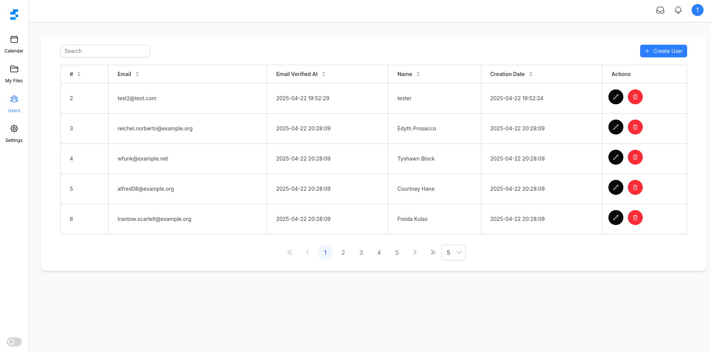

# Sassfolding



## Table of Contents

- [Introduction](#introduction)
- [Features](#features)
- [Architecture](#architecture)
- [Requirements](#requirements)
- [Installation](#installation)
- [Usage](#usage)
- [Documentation](#documentation)
- [Contributing](#contributing)

## Introduction

Setting up a new project has always been a real hassle for me: configuring tools, setting up linting, installing
packages, and, more importantly, making it collaborative.

That’s why I decided to create a reusable boilerplate that lets you scaffold a project quickly, with almost zero
configuration, thanks to the power of Docker and a few Make commands.

While the boilerplate is opinionated in terms of tooling, project structure, and code conventions, I hope you’ll still
find useful ideas or inspiration within it.

## Features

- 🐳 Docker-first development setup (Laravel, Hybridly, Node, Redis, Mailpit, RustFS, Traefik)
- ⚡ One-liner setup via **make install**
- 🧪 Preconfigured **.env** and **.env.testing** environments
- 🔏 SSL certificates with **mkcert** + **.test** TLD with local DNS resolver
- 🛠️ Built-in support for Husky Git hooks
- 📦 Modern stack (Pnpm, Tailwind CSS, Laravel, Hybridly, Nuxt UI, etc.)
- ✨ Code linting and formatting preconfigured (ESLint, Pint, etc.)
- 🔎 Robust types enforcement (Vue-TSC, PHPStan, Laravel Typescript-Transformer)
- 🥦 Taze: modern CLI tool to keep front-end dependencies up-to-date
- 📱 Fully responsive
- 🌓 Light & Dark Mode
- 🎨 Dynamic logo & favicon derived from **APP_NAME** and theme color

## Architecture

This project follows a **modular monolith** architecture where each module is self-contained with its own routes,
controllers, models, views, migrations, and tests.

### Module Dependency Rules

```
┌─────────────────────────────────────────────────────────────────┐
│                           CORE                                  │
│      Base classes, enums, middleware, UI components             │
│              Can be imported by ALL modules                     │
└─────────────────────────────────────────────────────────────────┘
                              ▲
┌─────────────────────────────┴───────────────────────────────────┐
│                         DATATABLES                              │
│                  Reusable table infrastructure                  │
│              Can be imported by ALL modules                     │
└─────────────────────────────────────────────────────────────────┘
                              ▲
┌─────────────────────────────┴───────────────────────────────────┐
│                           USERS                                 │
│    Model + Data can be imported by feature modules              │
│    Actions/Services stay encapsulated within module             │
└─────────────────────────────────────────────────────────────────┘
                              ▲
                  ┌─────────────────────┐
                  │                     │
          ┌───────┴───────┐     ┌───────┴───────┐
          │AUTHENTICATION │     │  [YOUR NEW    │
          │               │     │   MODULE]     │
          │Feature Module │     │Feature Module │
          └───────────────┘     └───────────────┘
        ✗ Feature modules should NOT import from each other
```

### Module Types

| Type           | Modules              | Can Import From                       | Can Be Imported By    |
|----------------|----------------------|---------------------------------------|-----------------------|
| Foundation     | Core                 | Laravel/Vendor, Users\Data            | All modules           |
| Infrastructure | Datatables           | Core                                  | All modules           |
| Domain         | Users                | Core, Datatables                      | All (Model/Data only) |
| Feature        | Authentication       | Core, Datatables, Users (Model/Data)  | None                  |

### Key Architectural Decisions

**Why Hybridly over Inertia?**

Hybridly provides tighter Laravel integration with features like automatic TypeScript type generation from PHP,
native table support, and a more Laravel-centric API. It bridges Laravel and Vue while maintaining strong typing
across the stack.

**Why RustFS over MinIO?**

MinIO entered maintenance mode in December 2025, with no new features and Docker images removed from public registries.
RustFS is a Rust-based, S3-compatible alternative that offers better performance (2.3x throughput for small objects)
and active development.

### Enforcing Boundaries

Architecture tests in `modules/Core/Tests/Architecture/` enforce these rules at CI time:

```bash
# Run architecture tests
./vendor/bin/pest --filter=Architecture
```

These tests will fail if:
- Core imports from any other module
- Feature modules import from each other
- Users Actions are used outside the Users module
- Controllers don't extend the base Controller
- Data objects don't extend Spatie\LaravelData\Data

## Requirements

To run this project, you need to have installed:

- [Docker (with docker compose >= 2.20.3)](https://docs.docker.com/engine/install/)
- [Git](https://git-scm.com/downloads)
- [Make](https://www.gnu.org/software/make/)
- [Mkcert](https://github.com/FiloSottile/mkcert?tab=readme-ov-file#installation)

## Installation

> [!IMPORTANT]
> You should first read the documentation
> [here](https://github.com/Jean-Da-Rocha/sassfolding-docker-local/blob/main/README.md) to get a good understanding on
> how docker powers this project.

- ```git clone https://github.com/Jean-Da-Rocha/sassfolding.git```
- ```cd sassfolding && make install```

Based on the `${COMPOSE_PROJECT_NAME}` variable (**sassfolding** in our case), the installation process will
automatically do the following:

- Create the dedicated .env files, replacing the `${COMPOSE_PROJECT_NAME}` variable in those files
- Generate SSL certificates for HTTPS
- Configure husky hooks
- Build the docker images
- Install pnpm & composer dependencies
- Generate keys for both .env and .env.testing files
- Configure a DNS resolver based on .test Top-Level Domain (TLD)
- Create the **sassfolding** and **sassfolding_testing** databases
- Start the shared infrastructure (Traefik and dnsmasq), then the project containers

You can always run ```make help``` in your console to see which commands are available.

> [!TIP]
> Don’t forget to run `make artisan cmd="migrate"` to run your migrations and `make composer cmd="autocomplete"`
> to enable autocompletion based on your database structure.

## Usage

Once the docker containers are running, you can access the following URL:

- **https://app.sassfolding.test** - The main application
- **https://mail.sassfolding.test** - The Mailpit dashboard to receive your emails locally
- **https://rustfs.sassfolding.test** - The RustFS dashboard to manage files, folders and buckets
- **https://storage.sassfolding.test** - The RustFS S3 API endpoint
- **https://traefik.localdev.test** - The Traefik dashboard to view your entrypoints, routes etc.

Traefik and dnsmasq are shared by every project on the machine, which is why the dashboard lives
under `localdev` rather than under the project name.

## Documentation

- [Datatables](docs/DATATABLE.md): how to build server-side tables with inline actions, bulk actions, sorting, and more
- [GitHub Actions](docs/GITHUB_ACTIONS.md): how the CI pipelines are built, cached, and why they don't use Docker

## Contributing

You're welcome to open issues or pull requests if you find bugs or want to suggest improvements, related to the Docker
setup or the Sassfolding app.
